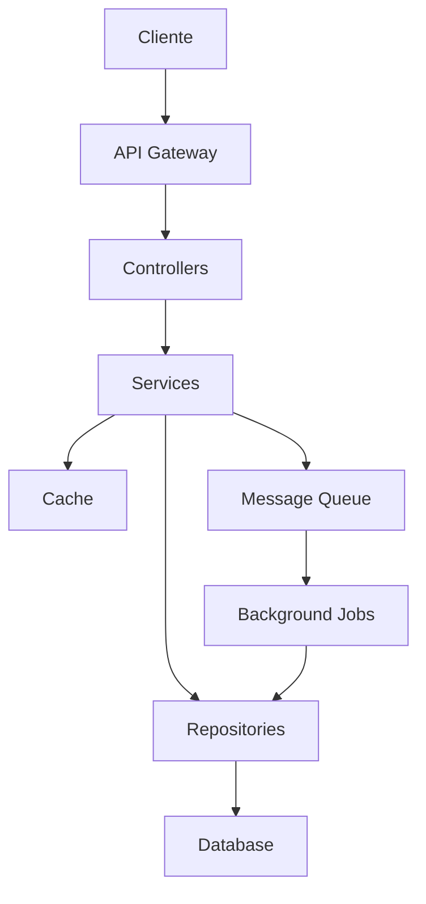

# Arquitetura do Sistema

## 🏗️ Visão Geral

O Consignaldo é construído seguindo os princípios de Clean Architecture e Domain-Driven Design (DDD), com uma estrutura modular que separa claramente as responsabilidades e mantém o domínio de negócio isolado de detalhes técnicos.

## 🎯 Objetivos Arquiteturais

1. **Manutenibilidade**
   - Código limpo e bem organizado
   - Baixo acoplamento entre módulos
   - Alta coesão dentro dos módulos
   - Fácil de testar e debugar

2. **Escalabilidade**
   - Processamento assíncrono
   - Cache distribuído
   - Balanceamento de carga
   - Microsserviços (futuro)

3. **Segurança**
   - Autenticação robusta
   - Autorização granular
   - Auditoria completa
   - Proteção contra ataques

4. **Performance**
   - Cache em múltiplas camadas
   - Otimização de consultas
   - Processamento em background
   - Compressão de dados

## 🔄 Fluxo de Dados



## 📦 Camadas

### 1. Apresentação (Controllers)
- Validação de entrada
- Transformação de dados
- Controle de acesso
- Documentação OpenAPI

### 2. Aplicação (Services)
- Regras de negócio
- Orquestração
- Transações
- Eventos

### 3. Domínio
- Entidades
- Value Objects
- Agregados
- Regras invariantes

### 4. Infraestrutura
- Persistência
- Cache
- Mensageria
- Logging

## 🔌 Integrações

### Bancos
- APIs REST
- Webhooks
- FTP Seguro
- Arquivos batch

### Órgãos Públicos
- Importação de folha
- Exportação de contratos
- Consulta de margens
- Averbação online

## 📊 Banco de Dados

### Schema Principal
```sql
-- Principais tabelas e relacionamentos
CREATE TABLE servidores (
  id SERIAL PRIMARY KEY,
  nome VARCHAR(100),
  cpf VARCHAR(11) UNIQUE,
  matricula VARCHAR(20),
  email VARCHAR(100),
  created_at TIMESTAMP,
  updated_at TIMESTAMP
);

CREATE TABLE vinculos (
  id SERIAL PRIMARY KEY,
  servidor_id INTEGER REFERENCES servidores(id),
  consignante_id INTEGER REFERENCES consignantes(id),
  cargo VARCHAR(100),
  data_admissao DATE,
  created_at TIMESTAMP,
  updated_at TIMESTAMP
);

CREATE TABLE contratos (
  id SERIAL PRIMARY KEY,
  servidor_id INTEGER REFERENCES servidores(id),
  consignataria_id INTEGER REFERENCES consignatarias(id),
  valor_parcela DECIMAL(10,2),
  num_parcelas INTEGER,
  valor_total DECIMAL(10,2),
  status VARCHAR(20),
  created_at TIMESTAMP,
  updated_at TIMESTAMP
);
```

### Índices
```sql
CREATE INDEX idx_servidores_cpf ON servidores(cpf);
CREATE INDEX idx_servidores_matricula ON servidores(matricula);
CREATE INDEX idx_contratos_servidor ON contratos(servidor_id);
CREATE INDEX idx_contratos_status ON contratos(status);
```

## 🔒 Segurança

### JWT
```typescript
interface JWTPayload {
  sub: number;        // ID do usuário
  username: string;   // Nome de usuário
  roles: string[];    // Papéis
  consignante?: number; // ID do consignante (se aplicável)
  iat: number;        // Issued at
  exp: number;        // Expiration
}
```

### RBAC
```typescript
enum Role {
  ADMIN = 'ADMIN',
  GESTOR = 'GESTOR',
  USUARIO = 'USUARIO',
  AUDITOR = 'AUDITOR',
  SISTEMA = 'SISTEMA'
}

interface Permission {
  resource: string;
  action: 'create' | 'read' | 'update' | 'delete';
}
```

## 🚀 Escalabilidade

### Cache
```typescript
interface CacheConfig {
  local: {
    driver: 'memory';
    ttl: number;
  };
  distributed: {
    driver: 'redis';
    url: string;
    ttl: number;
  };
}
```

### Filas
```typescript
interface QueueConfig {
  connection: {
    host: string;
    port: number;
  };
  queues: {
    notifications: {
      name: string;
      concurrency: number;
      attempts: number;
    };
    reports: {
      name: string;
      concurrency: number;
      attempts: number;
    };
  };
}
```

## 📈 Monitoramento

### Métricas
```typescript
interface Metrics {
  requests: {
    total: number;
    success: number;
    error: number;
    latency: number;
  };
  database: {
    connections: number;
    queryTime: number;
  };
  cache: {
    hits: number;
    misses: number;
  };
  queue: {
    waiting: number;
    processing: number;
    failed: number;
  };
}
```

### Logs
```typescript
interface LogEntry {
  timestamp: Date;
  level: 'info' | 'warn' | 'error';
  context: string;
  message: string;
  metadata: {
    userId?: number;
    requestId?: string;
    path?: string;
    duration?: number;
    error?: Error;
  };
}
```

## 🔄 Ciclo de Vida

### Request
1. Validação do JWT
2. Rate limiting
3. Validação de input
4. Autorização RBAC
5. Execução do handler
6. Transformação do output
7. Logging e métricas

### Background Job
1. Recebimento da mensagem
2. Deserialização
3. Validação
4. Processamento
5. Retry em caso de erro
6. Notificação de conclusão

## 📦 Deployment

### Docker
```dockerfile
# Exemplo de Dockerfile
FROM node:18-alpine

WORKDIR /app

COPY package*.json ./
RUN yarn install --production

COPY dist/ ./dist/
COPY .env.production ./.env

EXPOSE 3000

CMD ["yarn", "start:prod"]
```

### Kubernetes
```yaml
# Exemplo de deployment
apiVersion: apps/v1
kind: Deployment
metadata:
  name: consignaldo-api
spec:
  replicas: 3
  selector:
    matchLabels:
      app: consignaldo-api
  template:
    metadata:
      labels:
        app: consignaldo-api
    spec:
      containers:
      - name: api
        image: consignaldo/api:latest
        ports:
        - containerPort: 3000
        env:
        - name: NODE_ENV
          value: "production"
        - name: DATABASE_URL
          valueFrom:
            secretKeyRef:
              name: db-credentials
              key: url
```

## 🔄 CI/CD

### Pipeline
```yaml
# Exemplo de GitHub Actions
name: CI/CD

on:
  push:
    branches: [ main ]
  pull_request:
    branches: [ main ]

jobs:
  test:
    runs-on: ubuntu-latest
    steps:
    - uses: actions/checkout@v2
    - name: Setup Node.js
      uses: actions/setup-node@v2
      with:
        node-version: '18'
    - name: Install dependencies
      run: yarn install
    - name: Run tests
      run: yarn test

  deploy:
    needs: test
    runs-on: ubuntu-latest
    if: github.ref == 'refs/heads/main'
    steps:
    - name: Deploy to production
      run: |
        # Scripts de deploy
```

## 📚 Recursos

### Documentação
- [API Documentation](API.md)
- [Database Schema](DATABASE.md)
- [Security Guide](SECURITY.md)
- [Development Guide](DEVELOPMENT.md)

### Ferramentas
- [Postman Collection](../postman/collection.json)
- [Database Migrations](../prisma/migrations)
- [Docker Compose](../docker-compose.yml)
- [Environment Variables](.env.example)
